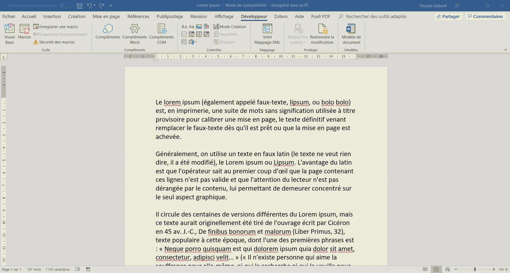

# Surlyllabe
A syllabic highlighter for Word in French language. Developed in VBA Word, the macro *SurlignageSyllabique* analyses every word contained in selection, calling a Python script to make their syllabation. Finally, it highlights each syllable with different colors, thanks to this analysis.
This project has been made-to-mesure for a French teacher in reading learning grade.



* Please note that the syllabation is based on French grammar rules and therefore brings no garantee for other languages.

* In addition to *SurlignageSyllabique*, the project comes with *SurlignageSemantique*, which highlights words the same way.

## Getting Started

These instructions will get you a copy of the project up and running on your local machine for running purposes.

### Prerequisite

What things you need to install the software and how to install them

##### Python 3.2+

Download the adequate installer, **version 3.2 or ulterior**, *Stable Releases* category, at the address https://www.python.org/downloads/windows/. Then follow the installation instructions.

### Installing

Installation of the Word and Python files in Word Add-Ins default location.

Just run the batch file :
````
%PathToRepository%\surlyllabe>setup.bat
````

Output should be :
````
%PathToRepository%\surlyllabe>ECHO OFF

Appuyez sur une touche pour lancer la copie des fichiers
word\Surlyllabe.dotm
1 fichier(s) copié(s)

python\syllabes.py
1 fichier(s) copié(s)

python\syllabation_encoder.py
1 fichier(s) copié(s)

My work here is done. Now it is time for me to retire.

Appuyez sur une touche pour continuer...
````

## Tree view

* `/word` : the Word Add-in containing VBA code of the macros
* `/python` : the Python files handling syllabation part of the project
* `/docs` : the documents used for project management

## Acknowledgments

* Syllabation part is greatly inspired by [@Stilnoxx](https://openclassrooms.com/fr/membres/francisvoilure)'s work available in this interesting [thread](https://openclassrooms.com/forum/sujet/comment-decoupe-une-chaine-de-caractere-en-syllabe-23388)
* Python call handling is taken from [@bburns.km](https://stackoverflow.com/users/243392/brian-burns)'s answer available [there](https://stackoverflow.com/questions/2784367/capture-output-value-from-a-shell-command-in-vba/32600510#32600510)
